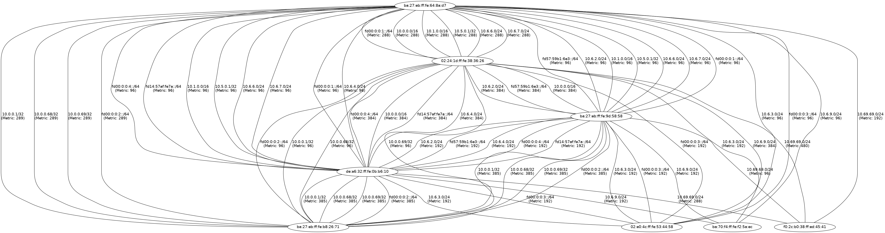

babelmap
========

Generates a global map of nodes and their routes based on data provided by the babel daemon

## Usage

Fill the file `peers.list` with the babel nods you want to contact with `<ip> <port>` pairings. An example is in the `peers.list` file in this repository.

## Dependancies

* `ncat`
* `python3`
